# Design Brief — схема архитектуры бота вакансий

> Назначение: этот файл — **промпт/спека для визуализации**. Скорми его Claude
> (artifacts / design) или любому диаграмм-тулу, чтобы отрисовать красивую,
> читаемую схему «что с чем связано».
> Основа — раздел #6 «Поток данных» из `ARCHITECTURE.md`, дополнено зонами,
> легендой, явным списком связей и готовой Mermaid-схемой.

---

## 0. TL;DR для дизайнера

Нарисуй **архитектурную схему потоков данных** для чат-бота управления вакансиями
в Google Chat. Система делает три вещи:

1. **Наблюдает** за корпоративным чатом и автоматически собирает базу вакансий (Pipeline A).
2. **Принимает решение** create/update/close для каждой вакансии через LLM + эмбеддинги (Pipeline B).
3. **Отвечает** пользователю в личке: текст, аналитика, графики (Pipeline C).

Ключевая мысль для композиции: это **три параллельных потока**, которые сходятся
в одной БД (Postgres + pgvector) и пользуются общим LLM-слоем. Покажи это
визуально: три «дорожки», общий низ (БД) и общий бок (LLM/AI-сервисы).

---

## 1. Визуальные зоны (группировка узлов)

Раздели холст на 5 логических зон. Это каркас композиции.

| Зона | Что внутри | Цвет-подсказка |
|---|---|---|
| **🟦 Внешний мир (Google)** | люди, Workspace Events, Pub/Sub, Chat API, OAuth | синий |
| **🟩 Наше приложение (FastAPI)** | api-endpoints + services + schemas | зелёный |
| **🟪 LLM-слой** | client.py + 5 ролей (prefilter/extractor/resolver/answerer/intent_router) | фиолетовый |
| **🟧 Внешний AI/инфра** | OpenAI (embeddings), OpenRouter (deepseek), QuickChart, ngrok | оранжевый |
| **🟥 Хранилище (Postgres + pgvector)** | 5 таблиц | красный/тёмный |

---

## 2. Узлы схемы (полный список)

### 🟦 Внешний мир — Google
- **Человек в чате A** — пишет «открыли python до 300k»
- **Человек в DM** — спрашивает бота «сколько вакансий открыто»
- **Google Workspace Events API (WE)** — ловит события чата
- **Google Cloud Pub/Sub** — topic `chat-events-topic`, push-подписка с JWT
- **Google Chat API** — доставляет запросы бота и отправляет ответы (текст / Cards V2)
- **OAuth 2.0** — refresh token для подписки от имени человека (одноразовый setup)

### 🟩 Наше приложение
**API (тонкие endpoints):**
- `api/pubsub.py` — `POST /chat/pubsub-push`
- `api/interactions.py` — `POST /chat/interaction`
- `schemas/incoming.py` — `parse_we_event()` → `IncomingMessage`

**Services (бизнес-логика):**
- `ingest.py` — сохранить сообщение + эмбеддинг
- `extraction.py` — prefilter → extractor → resolver (оркестратор)
- `entity_resolution.py` — арбитр create/update/close/pending
- `rag.py` — семантический поиск + сборка контекста
- `analytics.py` — count / list_recent / group_count / salaries
- `charts.py` — chart.js-конфиг + вызов QuickChart
- `chat_cards.py` — сборка Cards V2
- `interaction_handler.py` — главный диспетчер бота
- `google_oauth.py` — refresh → access token (только для setup-скрипта)

### 🟪 LLM-слой
- `llm/client.py` — единая обёртка `chat()` над OpenRouter
- `prefilter` — yes/no «про вакансию?» (reasoning off)
- `extractor` — текст → JSON {action, fields, entity_ref} (off, JSON-mode)
- `resolver` — entity_ref + кандидаты → vacancy_id / null (**reasoning high**, JSON)
- `answerer` — RAG-контекст → текст (high для «почему/как», иначе off)
- `intent_router` — запрос → Intent JSON (off, JSON-mode)

### 🟧 Внешний AI / инфра
- **OpenAI** — `text-embedding-3-small` (1536 dim), **только эмбеддинги**
- **OpenRouter** — `deepseek-v4-flash`, **весь generation/reasoning**
- **QuickChart.io** — chart.js JSON → PNG-URL
- **ngrok** — публичный HTTPS-туннель (dev)

### 🟥 Хранилище — Postgres + pgvector
- `chat_messages` — append-only лог сообщений (UNIQUE message_id)
- `chat_messages_embeddings` — вектора сообщений (ivfflat cosine)
- `vacancies` — mutable состояние вакансий (+ embedding title+description)
- `vacancy_revisions` — append-only журнал изменений
- `conversations` — память диалога (recent_turns, user_profile)

---

## 3. Связи — «что с чем связано» (главное)

Это рёбра графа. Стрелка = направление данных. Подпись на стрелке = что передаётся.

### Pipeline A — наблюдатель (сбор вакансий)
```
A1.  Человек(чат A)            ──пишет сообщение──▶  Google WE API
A2.  Google WE API            ──event published──▶  Pub/Sub topic
A3.  Pub/Sub                  ──push + JWT───────▶  POST /chat/pubsub-push (pubsub.py)
A4.  pubsub.py               ──base64+parse─────▶  schemas/incoming.parse_we_event → IncomingMessage
A5.  pubsub.py               ──background task──▶  ingest.ingest_message
A6.  pubsub.py               ──background task──▶  extraction.run_extraction
A7.  pubsub.py               ──204 ≤1s──────────▶  Pub/Sub (быстрый ACK)

# ingest_message (фон):
A8.  ingest.py               ──INSERT ON CONFLICT▶ chat_messages
A9.  ingest.py               ──embeddings.create─▶ OpenAI
A10. ingest.py               ──INSERT───────────▶  chat_messages_embeddings

# run_extraction (фон):
A11. extraction.py           ──читает тред/space─▶ chat_messages
A12. extraction.py           ──is_vacancy_message▶ prefilter ──▶ client.py ──▶ OpenRouter
A13. extraction.py           ──embed + top-3─────▶ OpenAI + vacancies (open)
A14. extraction.py           ──extract_vacancy───▶ extractor ──▶ client.py ──▶ OpenRouter
A15. extraction.py           ──resolve_and_save──▶ entity_resolution  (см. Pipeline B)
```

### Pipeline B — entity resolution (арбитр)
```
B1.  entity_resolution       ──embed(entity_ref)─▶ OpenAI
B2.  entity_resolution       ──cosine candidates─▶ vacancies (status != closed)
B3.  entity_resolution       ──resolve_entity────▶ resolver ──▶ client.py ──▶ OpenRouter (high)
B4.  entity_resolution       ──get message uuid──▶ chat_messages
B5.  entity_resolution       ──INSERT/UPDATE─────▶ vacancies
B6.  entity_resolution       ──журнал───────────▶  vacancy_revisions (create/update/close/pending)
```
Решения резолвера (4 ветки):
- match + conf ≥ 0.6 → UPDATE (create переписывается на update)
- null + action=create → INSERT новой
- match + conf < 0.6 → revision('pending') на ручной разбор
- null + action=update/close → warning, ничего не пишем

### Pipeline C — бот в личке (ответы)
```
C1.  Человек(DM)             ──вопрос────────────▶ Google Chat API
C2.  Google Chat API        ──POST + JWT────────▶ /chat/interaction (interactions.py)
C3.  interactions.py        ──get_or_create─────▶ conversations
C4.  interactions.py        ──handle_query──────▶ interaction_handler
C5.  interaction_handler    ──classify_intent───▶ intent_router ──▶ client.py ──▶ OpenRouter
C6.  interaction_handler    ──kind=search───────▶ rag + answerer        (см. ниже)
C7.  interaction_handler    ──kind=count────────▶ analytics.count_vacancies
C8.  interaction_handler    ──kind=list_recent──▶ analytics.list_recent
C9.  interaction_handler    ──kind=chart────────▶ analytics.group_count + charts + chat_cards
C10. interaction_handler    ──kind=salary_chart─▶ analytics.list_vacancy_salaries + charts + chat_cards
C11. interactions.py        ──append_turns──────▶ conversations
C12. interactions.py        ──text / cardsV2────▶ Google Chat API ──▶ Человек(DM)

# RAG-путь (_handle_search):
C6a. rag.py                 ──embed query───────▶ OpenAI
C6b. rag.py                 ──top-K cosine──────▶ chat_messages_embeddings (+ chat_messages)
C6c. rag.py                 ──top-K cosine──────▶ vacancies.embedding
C6d. rag.py                 ──читает память─────▶ conversations.recent_turns
C6e. answerer               ──generate_answer───▶ client.py ──▶ OpenRouter

# Графики:
C9a. charts.py              ──POST /chart/create▶ QuickChart.io ──PNG URL──▶ chat_cards (Cards V2)
```

### Сквозные связи
```
S1.  Все 5 LLM-ролей        ──единственная точка▶ client.py ──▶ OpenRouter
S2.  ingest/extraction/rag/analytics/resolution ──embeddings──▶ OpenAI
S3.  ngrok                  ──HTTPS-туннель─────▶ оба endpoint (dev)
S4.  google_oauth (setup)   ──refresh token─────▶ OAuth 2.0  (вне рантайма)
```

---

## 4. Готовая Mermaid-схема (рендерится сразу)

```mermaid
flowchart TD
    classDef ext fill:#dbeafe,stroke:#1e3a8a,color:#1e3a8a;
    classDef app fill:#dcfce7,stroke:#166534,color:#166534;
    classDef llm fill:#ede9fe,stroke:#5b21b6,color:#5b21b6;
    classDef ai  fill:#ffedd5,stroke:#9a3412,color:#9a3412;
    classDef db  fill:#fee2e2,stroke:#991b1b,color:#991b1b;

    %% ---------- Внешний мир ----------
    subgraph GOOGLE["🟦 Внешний мир — Google"]
        H1["👤 Человек · чат A"]:::ext
        H2["👤 Человек · DM"]:::ext
        WE["Workspace Events API"]:::ext
        PS["Cloud Pub/Sub<br/>chat-events-topic"]:::ext
        GCHAT["Google Chat API"]:::ext
    end

    %% ---------- AI / инфра ----------
    subgraph AISVC["🟧 Внешний AI / инфра"]
        OAI["OpenAI<br/>text-embedding-3-small"]:::ai
        OR["OpenRouter<br/>deepseek-v4-flash"]:::ai
        QC["QuickChart.io"]:::ai
    end

    %% ---------- LLM-слой ----------
    subgraph LLMZ["🟪 LLM-слой"]
        CLIENT["client.py · chat()"]:::llm
        PRE["prefilter"]:::llm
        EXT["extractor"]:::llm
        RES["resolver · high"]:::llm
        ANS["answerer"]:::llm
        IR["intent_router"]:::llm
    end

    %% ---------- Приложение ----------
    subgraph APP["🟩 Приложение · FastAPI"]
        PUB["api/pubsub.py<br/>POST /chat/pubsub-push"]:::app
        INT["api/interactions.py<br/>POST /chat/interaction"]:::app
        INGEST["ingest.py"]:::app
        EXTR["extraction.py"]:::app
        ER["entity_resolution.py"]:::app
        RAG["rag.py"]:::app
        ANL["analytics.py"]:::app
        CH["charts.py"]:::app
        CARDS["chat_cards.py"]:::app
        IH["interaction_handler.py"]:::app
    end

    %% ---------- БД ----------
    subgraph DB["🟥 Postgres + pgvector"]
        T_MSG["chat_messages"]:::db
        T_EMB["chat_messages_embeddings"]:::db
        T_VAC["vacancies"]:::db
        T_REV["vacancy_revisions"]:::db
        T_CONV["conversations"]:::db
    end

    %% ===== Pipeline A =====
    H1 -->|сообщение| WE
    WE -->|event| PS
    PS -->|push + JWT| PUB
    PUB -->|background| INGEST
    PUB -->|background| EXTR
    INGEST -->|INSERT ON CONFLICT| T_MSG
    INGEST -->|embed| OAI
    INGEST -->|INSERT| T_EMB
    EXTR -->|читает тред/space| T_MSG
    EXTR --> PRE
    EXTR -->|embed + top-3 open| OAI
    EXTR --> EXT
    EXTR -->|resolve_and_save| ER

    %% ===== Pipeline B =====
    ER -->|embed entity_ref| OAI
    ER -->|cosine candidates| T_VAC
    ER --> RES
    ER -->|INSERT/UPDATE| T_VAC
    ER -->|журнал| T_REV
    ER -->|msg uuid| T_MSG

    %% ===== Pipeline C =====
    H2 -->|вопрос| GCHAT
    GCHAT -->|POST + JWT| INT
    INT -->|get_or_create| T_CONV
    INT -->|handle_query| IH
    INT -->|append_turns| T_CONV
    IH --> IR
    IH -->|search| RAG
    IH -->|count / list| ANL
    IH -->|chart / salary| ANL
    RAG -->|embed query| OAI
    RAG -->|top-K| T_EMB
    RAG -->|top-K| T_VAC
    RAG -->|память| T_CONV
    RAG --> ANS
    ANL -->|embed topic| OAI
    ANL -->|COUNT / SELECT / GROUP BY| T_VAC
    IH --> CH
    CH -->|POST /chart/create| QC
    CH --> CARDS
    IH -->|text / cardsV2| INT
    INT -->|ответ| GCHAT
    GCHAT -->|показывает| H2

    %% ===== Сквозные: LLM-роли -> client -> OpenRouter =====
    PRE --> CLIENT
    EXT --> CLIENT
    RES --> CLIENT
    ANS --> CLIENT
    IR --> CLIENT
    CLIENT --> OR
```



---

## 5. Палитра и стиль (как должно выглядеть)

Не «дефолтная диаграмма из коробки». Направление — **технический editorial / blueprint**:

- **Фон:** очень светлый холодный серый (`oklch(98% 0.005 250)`) или тёмный navy для «blueprint»-варианта.
- **Зоны:** мягкие заливки по таблице из §1, скруглённые контейнеры (radius 12–16px),
  тонкая граница 1.5px цветом темнее заливки.
- **Узлы:** карточки с лёгкой тенью, моноширинный шрифт для имён файлов (`pubsub.py`),
  гротеск для подписей.
- **Стрелки:** разной «весомости» — основной поток толще, сквозные (LLM→client) тоньше/пунктир.
- **Цвет потоков:** Pipeline A — синий, B — фиолетовый, C — зелёный. Сразу видно три дорожки.
- **Акценты:** `resolver · high` и `204 ≤1s` подсветить — это смысловые точки.
- **Иерархия:** заголовки зон крупно, имена узлов средне, подписи рёбер мелко.
- Избегай равномерной сетки одинаковых прямоугольников — дай композиции ритм
  (БД широкой плашкой снизу, AI-сервисы колонкой справа).

---

## 6. Легенда

| Элемент | Значение |
|---|---|
| Сплошная толстая стрелка | основной поток данных |
| Тонкая/пунктир стрелка | сервисный вызов (LLM-роль → client, dev-туннель) |
| 🟦 синяя зона | внешние сервисы Google |
| 🟩 зелёная зона | наш код (FastAPI) |
| 🟪 фиолетовая зона | LLM-роли (один dispatcher) |
| 🟧 оранжевая зона | внешний AI + рендер графиков |
| 🟥 красная зона | данные (Postgres + pgvector) |
| `· high` | LLM-вызов с reasoning_effort=high |
| `≤1s` | требование скорости (Pub/Sub ACK) |

---

## 7. Что подчеркнуть смыслово (для подписей/выносок)

1. **Три потока, одна БД.** A пишет, B решает, C читает — но источник истины один.
2. **Двунаправленная LLM↔БД** в extraction: текст → embed → top-3 open vacancies → промпт.
   LLM «видит» актуальное состояние БД, а не только тред.
3. **Extractor — hint, resolver — арбитр.** Extractor видит только тред; финальное
   create/update/close решает resolver на основе БД (иначе дубли).
4. **Один dispatcher на 5 ролей** (`client.py`): единый биллинг/ретраи/логи, модель
   меняется в одном месте.
5. **Append-only + mutable.** `chat_messages`/`vacancy_revisions` — история;
   `vacancies` — быстрый ответ. Историю восстановим даже после удаления.
6. **3 уровня fallback в боте:** битый intent → RAG; пустой SQL → дружелюбный текст;
   упал QuickChart → те же числа текстом.
```
